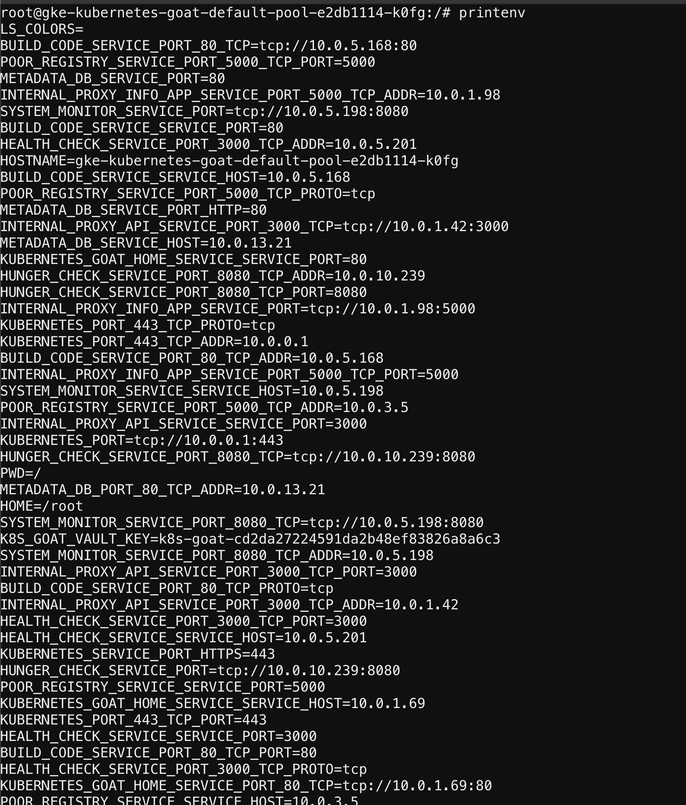

# Gaining environment information

## Scenario Information

Each environment in the Kubernetes will have lot of information to share. Some of the key things includes, secrets, apikeys, configs, services, many other. So let's go ahead and find the vault key!

* To get started with the scenario, navigate to [http://127.0.0.1:1233](http://127.0.0.1:1233)


## Scenario Solution

* Go ahead and explore the system as generic linux system

```bash
cat /proc/self/cgroup
cat /etc/hosts
mount
ls -la /home/
```


* Getting the environment variables, including kubernetes secrets mounted `K8S_GOAT_VAULT_KEY=k8s-goat-cd2da27224591da2b48ef83826a8a6c` and service names, ports, etc.

```bash
printenv
```



## Miscellaneous

TBD
