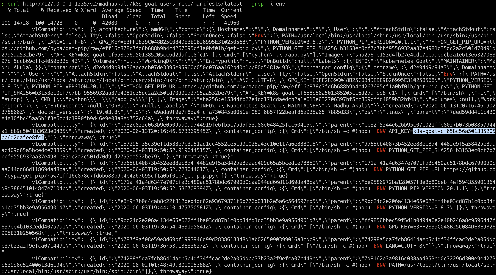

# Attacking private registry

## Scenario Information

Container registry is the place where all the container images gets pushed. Most of the time each organization have their own private registry. Also sometimes it ends up misconfigured, public/open. On the other hand, developers assumes that it's internal private registry only and end up storing all the sensitive information inside the container images. Let's see what we can find here.

* To get started with the scenario, navigate to [http://127.0.0.1:1235](http://127.0.0.1:1235)


## Scenario Solution

> As this is intentionally vulnerable design, we directly provided the endpoint. In real-world you have to do some recon.

* Based on the scenario and information, we identified that it's possible docker container private registry

* After reading some docs and googling, here is the simple API endpoint queries for the container registry

```bash
curl http://127.0.0.1:1235/v2/
curl http://127.0.0.1:1235/v2/_catalog
```


* Get more information about the images inside the registry from the API using below queries

```bash
curl http://127.0.0.1:1235/v2/madhuakula/k8s-goat-users-repo/manifests/latest
```


* Now, we observed that the docker container has ENV variable with API key information

```bash
```



> This can be taken little further by using `docker` client to download the images locally and analyzing. Also in some case you can even push the image to registry based on the permissions and privileges

## Miscellaneous

TBD
